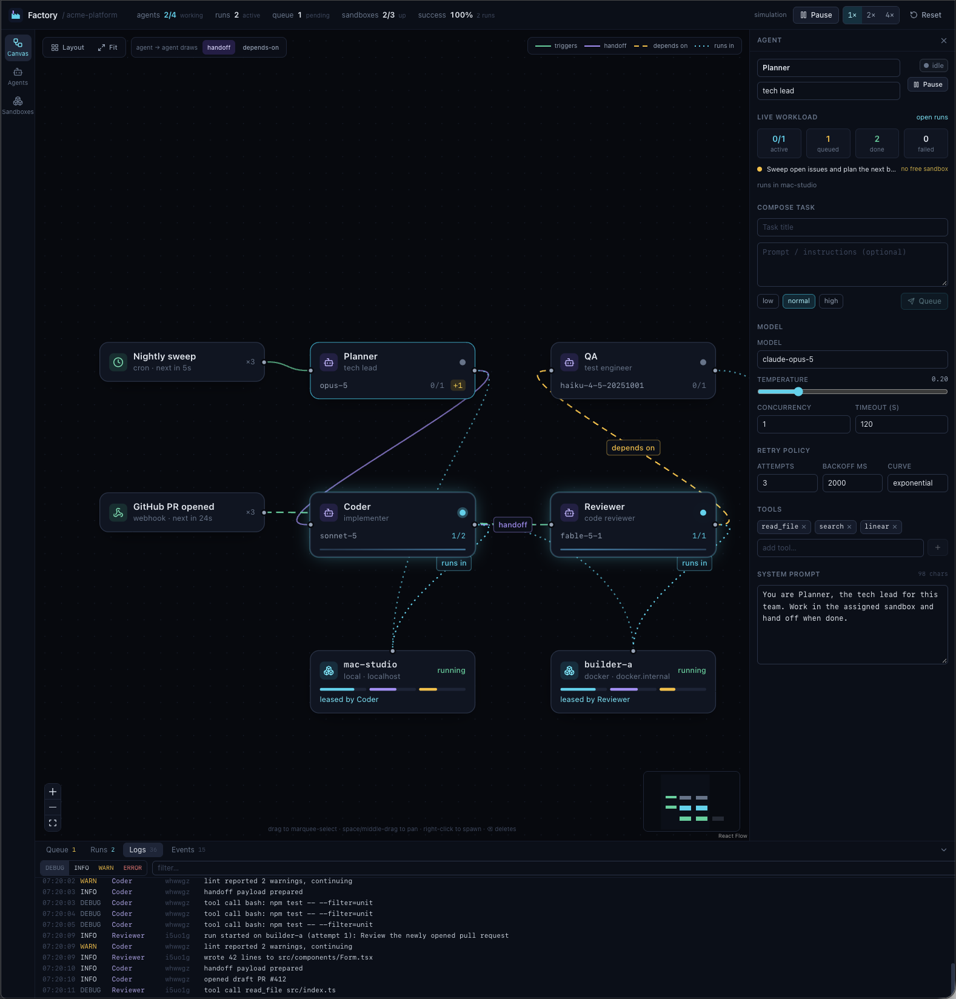

# Factory

An orchestration-graph control plane for a software factory: agents, sandboxes, triggers and task pipelines, with a simulated backend that keeps running while you watch.



The page is a client of a Node process on this machine. That process owns the world and the simulation loop. Closing every tab leaves the factory running. The process saves the world to a file, so stopping and starting it brings back the same graph, groups, tasks, run history and events. Nothing is written to `localStorage`.

## Run

```bash
npm install
npm run dev
```

`npm run dev` starts the factory server on `127.0.0.1:8787` and the Vite dev server. Open http://localhost:5173. Commands go over HTTP. A websocket pushes the full world after each change. The server accepts only that page's origin, spelled `localhost` or `127.0.0.1`. `npm run build` type-checks and produces the browser bundle. `npm run lint` runs oxlint.

### Where the world is stored

The server writes the world to `.factory/world.json` in the repository root. Set `FACTORY_DATA_DIR` to use another directory. The server prints the file path when it starts. `.factory/` is gitignored.

The server saves at most once per second and saves again when it stops. It keeps every running run, the newest 200 finished runs and the tasks they use, every pending task and its flow, and the newest 400 events. Logs are not saved. A run that was in progress when the server stopped comes back as failed with the reason `interrupted by restart`, and its task retries if the agent's retry policy allows it.

To reset the world, click Reset in the top bar. That deletes the file and loads the seed world. You can also stop the server and delete `world.json`.

If the file cannot be read or is not a valid world, the server starts from the seed world. It renames the bad file to `world.json.corrupt` and logs one error line with the path.

## MVP features

Canvas (React Flow v12)

- Three node types: agent, sandbox, trigger.
- Four edge kinds, validated by node type and drawn distinctly: triggers (green solid), handoff (violet solid), depends-on (amber dashed), runs-in (cyan dotted).
- Edges animate while their upstream agent is working, a trigger has just fired, or a sandbox is leased.
- Node positions are part of the world on the server. A server restart drops them and loads the seed.
- Auto-layout (dagre, left to right, sandboxes below the agents that use them), fit view, marquee select, right-click spawn, minimap, keyboard delete.
- Dragging a connection onto any part of a node connects it. A toolbar toggle picks handoff or depends-on for agent-to-agent edges. The edge inspector switches kinds after the fact.
- Undo and redo for spawn, delete, move, layout, connect, edge kind changes, edge deletes and inspector edits, from the Undo and Redo toolbar buttons or Cmd/Ctrl+Z and Shift+Cmd/Ctrl+Z (or Cmd/Ctrl+Y). Restored nodes and edges keep their ids. Typing into one inspector field is one step. Undo history belongs to one browser tab. Two tabs share the world and can overwrite each other's graph edits through undo. A reload or Reset clears that tab's history. There is no conflict handling.
- Copy, paste and duplicate a selection with Cmd/Ctrl+C, Cmd/Ctrl+V and Cmd/Ctrl+D. The copies get new ids, the same configuration and a 40 px offset, and become the selection. Only edges between the copied nodes come along. Runtime state (runs, tasks, leases, metrics, counters, last-fired time) is not cloned. Each paste or duplicate is one undo step.
- Group two or more ungrouped nodes, name the group, drag the group header to move the members together, and ungroup. Member positions stay absolute. Copies of grouped members are ungrouped.
- Keyboard shortcuts for undo, redo, copy, paste, duplicate, group, ungroup, and delete, with a `?` overlay that lists them. Inspector text fields keep native typing.

Agents

- Roster with fleet KPIs: utilization, throughput, failure rate, average run time, tokens.
- Inspector: name, role, model, temperature, concurrency, timeout, retry policy, tools editor, system prompt, live workload with per-run progress, pause and resume.
- Task composer: title, prompt, priority. Tasks land in the queue and run when a sandbox is free.

Sandboxes

- Pool of cards with live CPU, memory, disk, a CPU sparkline, lease holder and lease age.
- Lifecycle state machine: provisioning, running, stopping, stopped, rebuilding, destroying, error. Only legal actions are enabled. Provisioning and rebuilding animate with step text.
- Create new sandboxes (local, docker, vps, remote) and watch them come up.

Runs, logs, events

- Resizable bottom dock with Queue (with cancel and blocked-on reason), Runs (history, progress, attempts, tokens, duration), Logs (level filter, text filter, selected-agent filter, follow-tail that releases when you scroll up), and Events (click to jump to the node, edge, or run).

Simulation

- Cron and webhook triggers fire on an interval and enqueue tasks on connected agents.
- The scheduler respects concurrency, depends-on edges, and sandbox leases. Runs emit logs, succeed or fail, retry per policy, and hand off downstream.
- Pause, 1x/2x/4x speed, and reset to seed data from the top bar.

## Layout of the code

- `src/domain/types.ts` is the whole domain: branded ids, node and edge types, the sandbox transition table, the edge rule table, and the status colour tables.
- `src/domain/seed.ts` is the seed world.
- `server/simulation.ts` owns state, the tick loop, and the scheduler. Tests advance time with `advance` on that class. The network does not expose it.
- `server/worldFile.ts` reads and writes the world file. A save writes a temporary file and renames it over `world.json`. The storage choice is recorded in `docs/adr/0002-world-storage.md`.
- `server/http.ts` serves commands and the world websocket. The library choice is recorded in `docs/adr/0001-server-transport.md`.
- `src/api/client.ts` is the promise API the page calls. Graph methods return after the server has applied the command.
- `src/store.ts` holds the latest world snapshot plus UI state (view, selection, dock, and whether the socket is up).
- `src/history.ts` is one tab's undo and redo stack. Canvas and inspector graph edits go through it, and it replays them through the API under the original ids. `src/shortcuts.ts` matches and binds the keys.
- `src/clipboard.ts` holds the copied graph fragment and pastes it through the history, which calls `api.graph.paste`.
- `src/components/canvas` is the React Flow graph, `inspector` the right panel, `agents` and `sandboxes` the list views, `dock` the bottom panel.

## Not in the MVP yet

- Real backends: connecting to local, VPS and remote hosts, real agent processes, real logs.
- Auth, teams, multiple projects.

## License

MIT. See [LICENSE](LICENSE).
