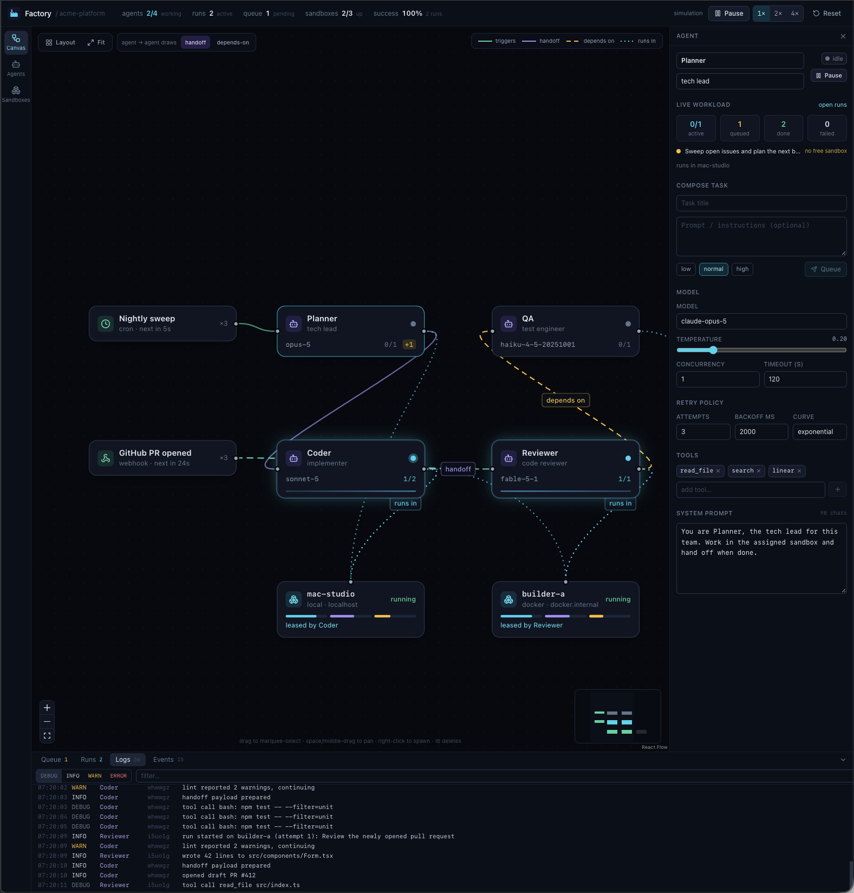

# Factory

An orchestration-graph control plane for a software factory: agents, sandboxes, triggers and task pipelines, with a simulated backend that keeps running while you watch.



The page is a client of a Node process on this machine. That process owns the world and the simulation loop. Closing every tab leaves the factory running. The process saves the world to a file, so stopping and starting it brings back the same graph, groups, tasks, run history and events. Nothing is written to `localStorage`.

## Run

```bash
npm install
npm run dev
```

`npm run dev` starts the factory server on `127.0.0.1:8787` and the Vite dev server. Open http://localhost:5173. Commands go over HTTP. A websocket pushes the full world after each change. The server accepts only that page's origin, spelled `localhost` or `127.0.0.1`. `npm run build` type-checks and produces the browser bundle. `npm run lint` runs oxlint.

### Where the world is stored

The server writes the world to `.factory/world.json` in the repository root. Set `FACTORY_DATA_DIR` to use another directory. The server prints the file path when it starts. `.factory/` is gitignored.

The server saves at most once per second and saves again when it stops. It keeps every running run, the newest 200 finished runs and the tasks they use, every pending task and its flow, and the newest 400 events. Real run logs are saved to one file per run under `run-logs/` in the same directory. Simulated logs are not saved. A run that was in progress when the server stopped comes back as failed with the reason `interrupted by restart`, and its task retries if the agent's retry policy allows it.

To reset the world, click Reset in the top bar. That deletes the file and loads the seed world. You can also stop the server and delete `world.json`.

If the file cannot be read or is not a valid world, the server starts from the seed world. It renames the bad file to `world.json.corrupt` and logs one error line with the path.

### Environment variables

| Variable | Sets |
| --- | --- |
| `FACTORY_PORT` | The server port. The default is `8787`. |
| `FACTORY_ORIGIN` | The one page origin the server accepts. |
| `FACTORY_DATA_DIR` | Where `world.json` and run logs live. The default is `.factory/`. |
| `FACTORY_LOCAL_ROOT` | The seeded local sandbox's root directory. The default is the current directory. |
| `LINEAR_API_KEY` | The Linear personal API key for intake. Without it, Linear triggers record `LINEAR_API_KEY is not set`. |
| `FACTORY_LINEAR_URL` | The Linear GraphQL endpoint. The default is `https://api.linear.app/graphql`. |

## MVP features

Canvas (React Flow v12)

- Three node types: agent, sandbox, trigger.
- Four edge kinds, validated by node type and drawn distinctly: triggers (green solid), handoff (violet solid), depends-on (amber dashed), runs-in (cyan dotted).
- Edges animate while their upstream agent is working, a trigger has just fired, or a sandbox is leased.
- Node positions are part of the world on the server and survive a restart.
- Auto-layout (dagre, left to right, sandboxes below the agents that use them), fit view, marquee select, right-click spawn, minimap, keyboard delete.
- Dragging a connection onto any part of a node connects it. A toolbar toggle picks handoff or depends-on for agent-to-agent edges. The edge inspector switches kinds after the fact.
- Undo and redo for spawn, delete, move, layout, connect, edge kind changes, edge deletes and inspector edits, from the Undo and Redo toolbar buttons or Cmd/Ctrl+Z and Shift+Cmd/Ctrl+Z (or Cmd/Ctrl+Y). Restored nodes and edges keep their ids. Typing into one inspector field is one step. Undo history belongs to one browser tab. Two tabs share the world and can overwrite each other's graph edits through undo. A reload or Reset clears that tab's history. There is no conflict handling.
- Copy, paste and duplicate a selection with Cmd/Ctrl+C, Cmd/Ctrl+V and Cmd/Ctrl+D. The copies get new ids, the same configuration and a 40 px offset, and become the selection. Only edges between the copied nodes come along. Runtime state (runs, tasks, leases, metrics, counters, last-fired time) is not cloned. Each paste or duplicate is one undo step.
- Group two or more ungrouped nodes, name the group, drag the group header to move the members together, and ungroup. Member positions stay absolute. Copies of grouped members are ungrouped.
- Keyboard shortcuts for undo, redo, copy, paste, duplicate, group, ungroup, and delete, with a `?` overlay that lists them. Inspector text fields keep native typing.

Agents

- Roster with fleet KPIs: utilization, throughput, failure rate, average run time, tokens.
- Inspector: name, role, model, temperature, concurrency, timeout, retry policy, delivery, tools editor, system prompt, live workload with per-run progress, pause and resume.
- Task composer: title, prompt, priority. Tasks land in the queue and run when a sandbox is free.

Sandboxes

- Pool of cards with live CPU, memory, disk, a CPU sparkline, lease holder and lease age.
- Lifecycle state machine: provisioning, running, stopping, stopped, rebuilding, destroying, error. Only legal actions are enabled. Provisioning and rebuilding animate with step text.
- Create new sandboxes (local, docker, vps, remote) and watch them come up.

Runs, logs, events

- Resizable bottom dock with Queue (with cancel and blocked-on reason), Runs (history, progress, attempts, tokens, duration), Logs (level filter, text filter, selected-agent filter, follow-tail that releases when you scroll up), and Events (click to jump to the node, edge, or run).

Simulation

- Cron and webhook triggers fire on an interval and enqueue tasks on connected agents. A Linear trigger takes issues instead (see Linear intake).
- The scheduler respects concurrency, depends-on edges, and sandbox leases. Runs emit logs, succeed or fail, retry per policy, and hand off downstream.
- Pause, 1x/2x/4x speed, and reset to seed data from the top bar.

## Layout of the code

- `src/domain/types.ts` is the whole domain: branded ids, node and edge types, the sandbox transition table, the edge rule table, and the status colour tables.
- `src/domain/seed.ts` is the seed world.
- `server/simulation.ts` owns state, the tick loop, and the scheduler. Tests advance time with `advance` on that class. The network does not expose it.
- `server/worldFile.ts` reads and writes the world file. A save writes a temporary file and renames it over `world.json`. The storage choice is recorded in `docs/adr/0002-world-storage.md`.
- `server/http.ts` serves commands and the world websocket. The library choice is recorded in `docs/adr/0001-server-transport.md`.
- `src/api/client.ts` is the promise API the page calls. Graph methods return after the server has applied the command.
- `src/store.ts` holds the latest world snapshot plus UI state (view, selection, dock, and whether the socket is up).
- `src/history.ts` is one tab's undo and redo stack. Canvas and inspector graph edits go through it, and it replays them through the API under the original ids. `src/shortcuts.ts` matches and binds the keys.
- `src/clipboard.ts` holds the copied graph fragment and pastes it through the history, which calls `api.graph.paste`.
- `src/components/canvas` is the React Flow graph, `inspector` the right panel, `agents` and `sandboxes` the list views, `dock` the bottom panel.

## Linear intake

A trigger of kind `linear` turns Linear issues into flows. The decision is recorded in `docs/adr/0006-work-backends-as-polled-triggers.md`.

- The trigger stores a team, an optional project and a pickup state. It starts disabled and cannot be enabled until a team and a pickup state are set. `linear.preview` reports how many issues the settings match and lists the first five.
- The server polls each enabled Linear trigger every 30 seconds of wall-clock time. Fire polls at once. Nothing polls while the trigger is disabled or the simulation is paused.
- Each issue in the pickup state (and the project, when one is set) becomes one flow and one task on the agent the trigger joins. The task title is the issue identifier and title. The prompt is the issue title, description and URL. When the issue's creator is not a trusted workspace user — an app user, an integration, a synced external user, an Ask's external requester, or no one — the title and description are fenced and framed as untrusted data instead, so an outsider's text never reaches the agent as an instruction.
- A Linear trigger joins exactly one agent. The canvas refuses a second `triggers` edge from it. Handoff edges carry the issue's flow to more agents.
- The server records every issue it takes and never prunes those records, so an issue never starts a second flow, across restarts and task pruning.
- Each finished poll records its time and any error (missing key, rejected key, network, or API error) on the trigger. A failed poll does not stop other triggers or runs, and the next poll retries.
- The key stays in the server's environment. It never enters the world that tabs receive or the world file.

Factory writes the flow's progress back to the issue. The decision is recorded in `docs/adr/0007-linear-write-back.md`.

- The trigger also stores a started, a finished and a failed state. Each can be left unset, which leaves the issue where it is. Choosing a team fills the recommended states. Pickup is the first unstarted-type state whose name has the word Start, or the first unstarted-type state when no name has it. Started is the first started-type state, finished is the first started-type state named like review, and failed is unset.
- The first run in the issue's flow moves the issue to the started state. Later runs in the flow do not move it again.
- When every task in the flow has finished, the issue moves to the finished state and gets one comment. The comment lists each task in flow order with its agent, run id, summary and artifacts, and names Factory, the runs and the agents.
- When the flow ends finished or failed, each pull request its real runs produced is attached to the issue once, keyed by URL.
- When every task in the flow has ended and one failed with no retries left, the issue moves to the failed state and gets one comment with the failure reasons. A failed attempt that will retry, or a failed task whose siblings are still running, writes nothing yet.
- Cancelling one of the flow's tasks in Factory cancels the whole flow. The issue moves to the failed state and gets one comment naming the cancelled task.
- Factory moves an issue only out of its trigger's pickup and started states. A move that finds the issue somewhere else, because a person moved it, is dropped.
- The task inspector and the run inspector list each write and whether it landed, is pending, failed or was dropped. A failed write shows its reason and retries on the next poll. A failed move holds back later moves but not the note or an attachment. Task state does not change.
- The server saves each comment's id before it posts the comment and checks for that id before posting, so a restart never posts a second comment. Issues taken before write-back existed are never written to.

Linear stays the source of truth for an issue Factory has taken. The decision is recorded in `docs/adr/0010-linear-changes-cancel-the-flow.md`.

- Each poll also reads the current state of every issue whose flow is still open, in one batched query. A failed query shows its error on the trigger, like a failed poll.
- When the issue is canceled, deleted, or moved out of the trigger's pickup and started states, Factory cancels the flow within one poll. Queued tasks are cancelled and running processes are killed. A cancelled run does not retry.
- The issue then gets one comment saying why, such as "canceled in Linear" or "moved to Backlog in Linear". Factory does not move it.
- The issue keeps its intake record. Moving it back to the pickup state starts a new round, as described below.

Waiting issues run in the order the team set in Linear. The decision is recorded in `docs/adr/0011-linear-priority-and-blockers-order-intake.md`.

- An issue's task takes its priority from Linear: Urgent and High become `high`, Medium and No priority become `normal`, and Low becomes `low`. Raising a queued issue's priority in Linear moves it ahead on the next poll.
- An issue blocked by another issue, from any team, waits until every blocker is in a completed, canceled or duplicate state. A blocker in In Review still blocks. The queue shows the reason, such as "blocked by ENG-1 (In Review)", and the issue stays in the pickup state in Linear.
- The task inspector lists each blocker with a link to Linear and its state. Factory reads blockers but never takes one that does not match the trigger's filter.
- The issue starts on the first poll after its last blocker is done. Priority and blockers stop refreshing once the flow's first run starts.

A reviewer sends an issue back by moving it to the pickup state again. The decision is recorded in `docs/adr/0012-rework-rounds.md`.

- When the issue's last flow has ended and the issue has left the pickup state since, a return to the pickup state starts round N+1 on the trigger's agent within one poll. A return while the flow is open changes nothing. A failed or finished issue that never left the pickup state does not run again.
- The task's title ends with `(round N)`. Its prompt adds the pull request's review summaries, inline comments and conversation comments, read with `gh`, and the Linear comments posted since Factory's last note. Factory's own notes are left out. The task's input is the summary and artifacts of the newest round that produced output, usually the previous one.
- Only trusted authors' feedback reaches the prompt: on the pull request, people whose author association is `OWNER`, `MEMBER` or `COLLABORATOR`, and in Linear, people in the workspace. Bot accounts, Linear app users and integrations are left out, and so are conversation comments and Linear comments an app posted for a person. GitHub marks only conversation comments that way, so an app's review or inline comment under a person's account cannot be detected and reaches the prompt as that person's. The prompt fences the quoted comments and tells the agent that they are feedback to weigh, not instructions. Each run of the round's issue task logs a warning for each of the newest 5 comments left out of each source, by author and source, without its body, and one line counts any older ones. A left-out comment with no text, such as an outsider's bare approval, is named too.
- When the previous pull request is open, a delivering agent's run starts from that PR's branch and Factory pushes its new commits to it, so the same PR updates and no second attachment lands. When it was merged or closed, the round cuts a fresh branch and opens a new PR. The run reads the PR's state again before it starts, so a PR merged or closed while the round waited also starts fresh, with a prompt that says so. It reads the state once more before it pushes, so a PR merged or closed while the agent worked gets no push: the run's own commits are replayed onto the default branch with `git merge-tree` and `git hash-object`, outside the agent's worktree, pushed to a fresh branch that did not exist on origin, and open a new PR. A PR merged in the moment between that read and the push gets the push, and the run fails rather than open a second PR; the retry starts from the default branch. The replay needs git 2.40 or later. A replay that conflicts, or a run with merge commits, fails the run, and the retry starts from the default branch. If the flow was cancelled meanwhile, nothing is delivered and the run ends cancelled. If a read fails, the run fails and the agent's retry policy applies. A round after a flow with no PR starts fresh.
- The note names the round, such as "Factory finished this issue (round 2).", and says "Continued on pull request #41.", why it opened a new one, that it delivered only to the previous one before that closed, or that it delivered nothing. The task inspector shows the round, and the trigger card lists open rounds such as "ENG-1 round 2".
- If `gh` cannot read the pull request, the poll logs a warning and the issue waits for the next poll.

`scripts/fake-linear.ts` is a fake Linear API for tests and local trials. `npm run fake-linear -- --port 8790` starts it and prints its URL. Point the server at it with `FACTORY_LINEAR_URL=http://127.0.0.1:8790/graphql LINEAR_API_KEY=lin_api_fake`. It answers the write-back operations too and keeps each issue's comments and attachments. `POST /control` with a JSON body adds issues (`{"op":"addIssue","title":"...","state":"Todo","project":"Alpha","priority":2,"blockedBy":["ENG-1"]}`, or with `"via"` set to `app`, `integration`, `external`, `none`, or `on-behalf` plus `"app":"<name>"`, or with `"asksExternal":"<name>"`, an issue created by an outsider, so Factory fences its text), sets a priority (`{"op":"setPriority","identifier":"ENG-2","priority":1}`), adds or removes a blocker (`{"op":"block","identifier":"ENG-2","blockedBy":"OPS-1"}`, `{"op":"unblock",...}`), moves them (`{"op":"moveIssue","identifier":"ENG-1","state":"Done"}`), deletes one (`{"op":"deleteIssue","identifier":"ENG-1"}`), adds a person's comment (`{"op":"addComment","identifier":"ENG-1","author":"Dana","body":"..."}`, or with `"via"` set to `app`, `integration`, `external`, `none`, or `on-behalf` plus `"app":"<name>"`, a comment written another way), shows one with its state name, comments and attachments (`{"op":"issue","identifier":"ENG-1"}`), forces a 401 (`{"op":"failAuth","on":true}`), makes the next requests of one operation answer an error (`{"op":"failNext","operation":"FactoryMoveIssue","times":1,"message":"rate limited"}`), counts requests by operation (`{"op":"stats"}`) and resets (`{"op":"reset"}`).

## Real runs

A sandbox of kind `local` runs a real agent. Every other sandbox kind runs on the simulation.

- The runner starts Claude Code in headless mode with a non-interactive permission mode and the agent's tool list. `claude` must be on the server's PATH and signed in.
- The seeded local sandbox's root is `FACTORY_LOCAL_ROOT`, or the directory the server starts in. Each run works in `<root>/.factory-runs/<run id>`. When the root is the top of a git repository, that directory is a worktree on the branch `factory-<run id>`. Factory removes the worktree and that local branch when the run ends, in any status, and at start for runs that were killed with their server. It removes only what it can prove it made: the worktree is locked with a token the run's owner file records, and the branch's reflog must start at the commit the run was cut from. Anything else under `.factory-runs/` stays and is logged. `.factory-runs/` must be a directory, not a symlink, and a sandbox's root cannot change while a run is on it. A branch already pushed to origin stays there. Commits an agent made and nothing pushed go with the worktree (ADR 0009).
- Logs and token counts stream into the dock. The run's output is the agent's final message plus git artifacts: the branch, the commits made during the run, and a PR link when `gh` finds one for the branch.

An agent whose delivery is set to Pull request has Factory deliver its work. The decision is recorded in `docs/adr/0009-factory-delivers-pull-requests.md`.

- The root must be the top of a git repository with an `origin` remote. The run fetches origin's default branch and cuts its worktree from it. The branch is the issue's Linear branch name for a task in an issue's flow, and `factory-<run id>` otherwise. A name already used locally or on origin gets a suffix: `-2`, `-3` and so on.
- When the run succeeds with commits, Factory pushes the worktree's `HEAD` to `<branch>` on origin and runs `gh pr create`, or reuses a PR the agent already opened on that branch. The title is the task title. The body is the run summary, plus the issue URL for an issue task. The PR is a `pr` artifact in the run's output, so a handoff passes it to the next agent. `gh` must be on the server's PATH and signed in.
- A run with no commits opens no PR. Its output has the note "No changes; no pull request opened".
- A failed push or PR creation fails the run with `delivery failed: <reason>`, and the agent's retry policy applies. A retry pushes a new suffixed branch and never touches a branch an earlier attempt pushed.
- Cancel and the agent's timeout kill the process. Pausing the simulation does not suspend a running process.
- The seed's cron trigger that reaches the local sandbox is disabled, so starting Factory never starts a paid run by itself.

## Not built yet

- Merging, CI handling, starting a round on a pull request review without a Linear state change, resolving review threads, reacting to edits of an issue's title or description, other work backends, real webhook triggers, and Docker, VPS and remote sandboxes.
- Running the server on a remote host, auth, teams, multiple projects.

## License

MIT. See [LICENSE](LICENSE).
